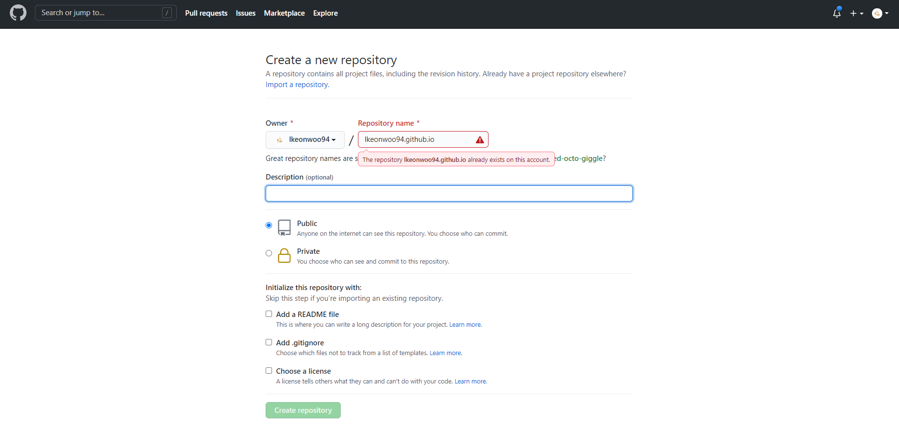
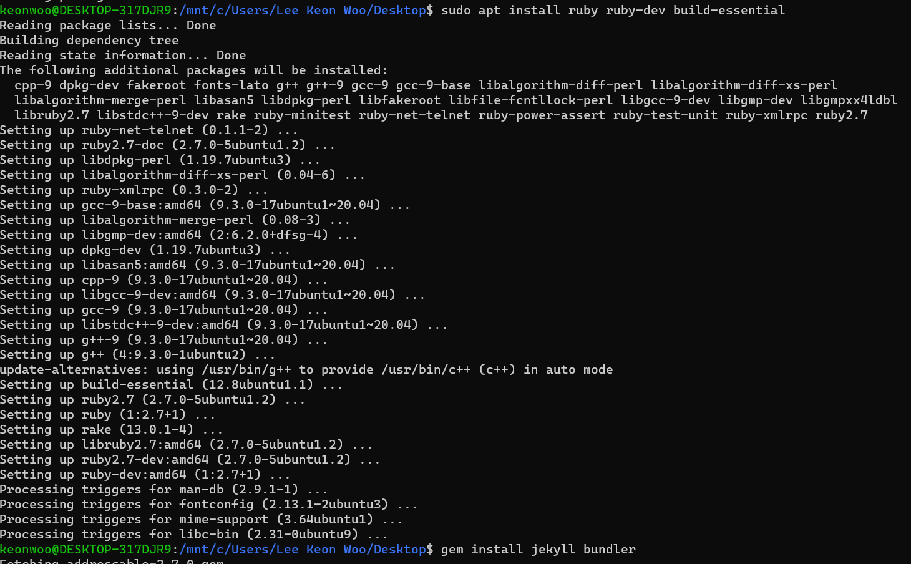
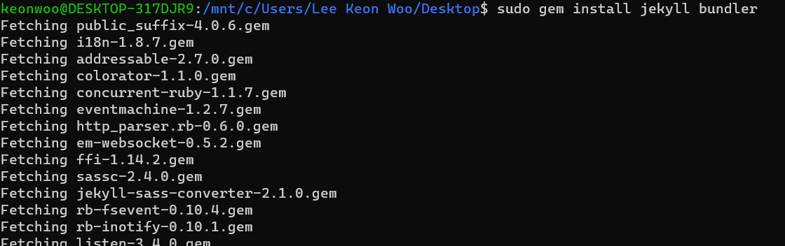
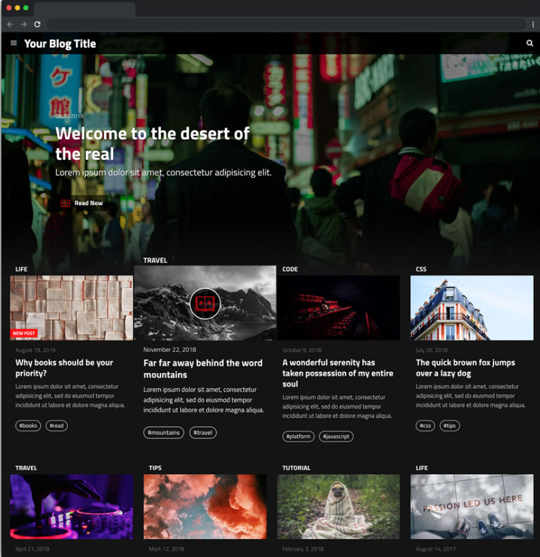
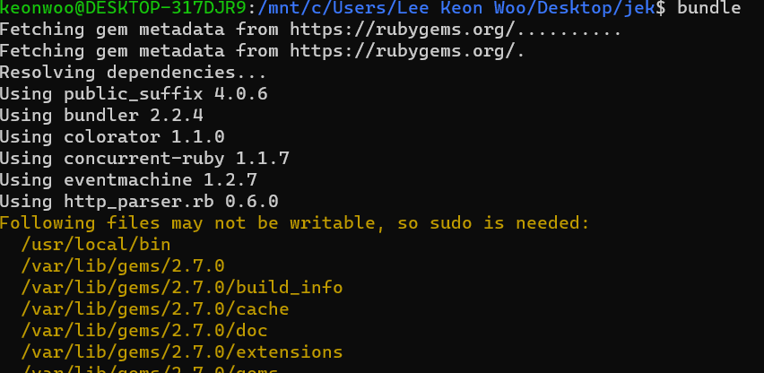
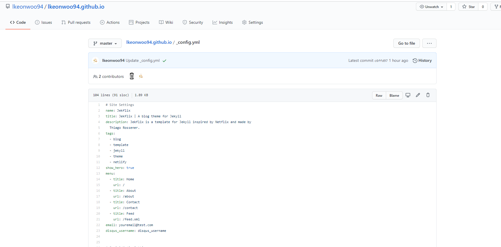
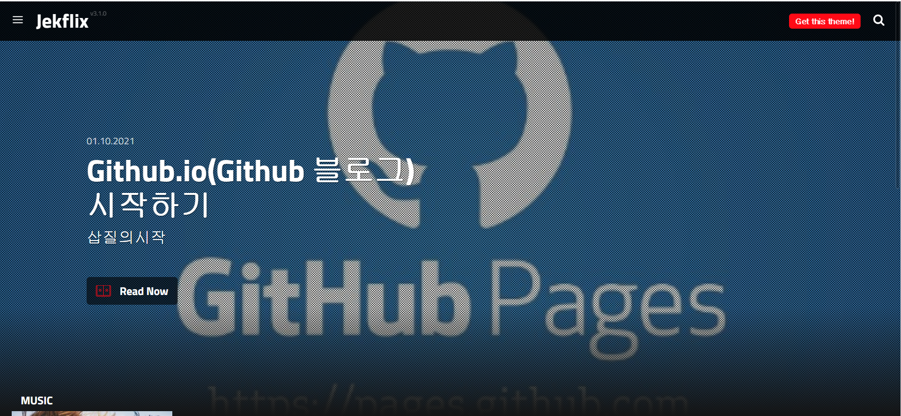

## Github io (블로그) 만들기

### 1. Repository 생성하기
---
- repository name은 “username.github.io” 이렇게 설정하면 됩니다.
- 이 때, username은 github에 있는 user name을 사용합니다.
- 제 경우는 lkeonwoo94.github.io 가 될 것입니다.




### 2. 터미널을 열어서 Ruby를 깔아줍니다
---
```
$ sudo apt install ruby ruby-dev build-essential
```



### 3. jekyll 과 bundler 를 깔아줍니다
---
```
$ sudo gem install jekyll bundler
```


    
*Ruby가 설치되어있지 않으면 gem을 사용할 수 없습니다*


### 4. 받을 jekyll thema의 github를 들어갑니다
---
저같은 경우는 [jekflix](https://github.com/thiagorossener/jekflix-template)를 선택했는데, 그냥 가장 깔끔해보였습니다.
(다른 마음에 드는 테마를 찾기가 귀찮기도 했고)

```
git clone https://github.com/thiagorossener/jekflix-template.git [받을 폴더명] 
```



### 5. Clone이 완료되면 [폴더] 안으로 들어가 Bundler를 실행합니다.
---
```
cd [폴더명]
$ bundle
```

Bundler를 처음 사용하면 아래와 같은 창이 뜨는데, Password 아무거나 입력하고 넘어갑니다

```
Your user account isn't allowed to install to the system RubyGems.
  You can cancel this installation and run:

      bundle config set --local path 'vendor/bundle'
      bundle install

  to install the gems into ./vendor/bundle/, or you can enter your password
  and install the bundled gems to RubyGems using sudo.

  Password:
```




### 6. 아까 파둔 [본인] Repository에 올려줍니다
---
```
$ git remote remove origin // 기존의 remote 삭제
$ git remote add origin "본인이만들었던 repo 주소" 
$ git remote -v      // 본인의 repo가 remote 된 것을 확인
$ git push -u origin master     //본인의 git repo에 업로드
```

### 7. 본인 Repository의 _config.yml 파일을 수정해줍니다
---
주욱 내리다 보면 Advanced Settings에 url이 있습니다. 이 곳에 자기 "username".github.io 를 입력해줍니다
```
# Advanced Settings
baseurl: "" # the subpath of your site, e.g. /blog
url: "https://lkeonwoo94.github.io" # the base hostname & protocol for your site
google_analytics: "UA-XXXXXXXX-X"
language: "en"
categories_folder: category
sent_message_url: "/contact/message-sent/"
```




### 8. 완성된 모습




다음시간에는 Posting을 어떻게 하는지 올리겠습니다.
